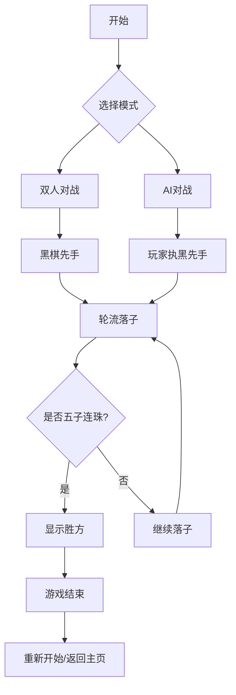

# 五子棋游戏 - 产品需求文档

## 1. 产品概述

一款优雅的网页版五子棋对战游戏，提供流畅的落子体验和精致的视觉设计。玩家可以与朋友一起双人对战，或选择与AI进行单人对战。

- 双人对战模式：两位玩家在同一设备上交替落子
- AI对战模式：玩家执黑棋与AI进行对战
- 实时胜负判定：五子连珠时自动提示胜方
- 优雅的视觉体验：采用复古木质纹理的棋盘设计

## 2. 核心功能

### 2.1 用户角色

| 角色 | 说明 | 核心权限 |
|------|------|----------|
| 玩家 | 游戏参与者 | 落子、选择模式、重开游戏 |

### 2.2 功能模块

1. **游戏主页**：开始游戏按钮、模式选择（双人对战/AI对战）
2. **游戏棋盘**：15x15标准棋盘、棋子展示、落子动画
3. **游戏控制**：重新开始、返回主页
4. **胜负提示**：胜利时显示获胜方

## 3. 核心流程

## 4. 用户界面设计

### 4.1 设计风格

- **主题**：复古木质风格，结合现代简约元素
- **主色调**：深棕色 #5D4037 (木纹)、米白色 #EFEBE9 (背景)
- **棋子颜色**：黑色 #1A1A1A、白色 #FAFAFA
- **字体**：Noto Serif SC (标题)、Noto Sans SC (正文)
- **布局**：居中式设计，棋盘占据视觉中心

### 4.2 页面设计

| 页面 | 模块 | UI元素 |
|------|------|--------|
| 首页 | 游戏标题 | 毛笔书法风格标题、模式选择按钮 |
| 首页 | 模式选择 | 双人对战按钮、AI对战按钮 |
| 游戏页 | 棋盘 | 15x15木纹棋盘、网格线 |
| 游戏页 | 棋子 | 圆形棋子、阴影效果、落子动画 |
| 游戏页 | 信息栏 | 当前落子方提示、重新开始按钮 |
| 游戏页 | 胜负弹窗 | 半透明遮罩、胜方提示、重新开始按钮 |

### 4.3 响应式设计

- 桌面优先设计，保持棋盘在合理尺寸
- 移动端自适应，棋盘缩放至屏幕宽度90%
- 触摸优化，大按钮便于点击
