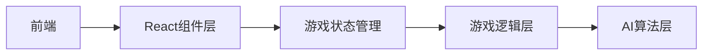

# 五子棋游戏 - 技术架构文档

## 1. 架构设计



## 2. 技术选型

- **前端框架**：React@18
- **构建工具**：Vite
- **样式方案**：Tailwind CSS
- **状态管理**：React useState/useReducer
- **AI算法**：Minimax算法 + Alpha-Beta剪枝

## 3. 路由定义

| 路由 | 用途 |
|------|------|
| / | 首页 - 模式选择 |
| /game | 游戏页 - 棋盘对战 |

## 4. 核心组件

| 组件 | 职责 |
|------|------|
| App | 根组件，路由管理 |
| Home | 首页，模式选择 |
| Game | 游戏主页面 |
| Board | 棋盘组件 |
| Cell | 单个格子组件 |
| Piece | 棋子组件 |
| Modal | 胜负弹窗 |
| Button | 通用按钮 |

## 5. 数据结构

### 5.1 棋盘状态

```typescript
type Player = 'black' | 'white' | null;
type Board = Player[][]; // 15x15 二维数组
```

### 5.2 游戏状态

```typescript
interface GameState {
  board: Board;           // 棋盘状态
  currentPlayer: Player;  // 当前落子方
  winner: Player;        // 获胜方
  gameMode: 'pvp' | 'ai'; // 游戏模式
  isGameOver: boolean;    // 游戏是否结束
}
```

## 6. AI算法设计

- **算法**：Minimax + Alpha-Beta剪枝
- **搜索深度**：3层
- **评估函数**：基于棋型评分（活四、冲四、活三、眠三等）
